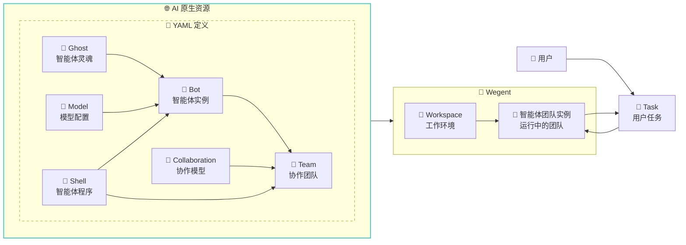
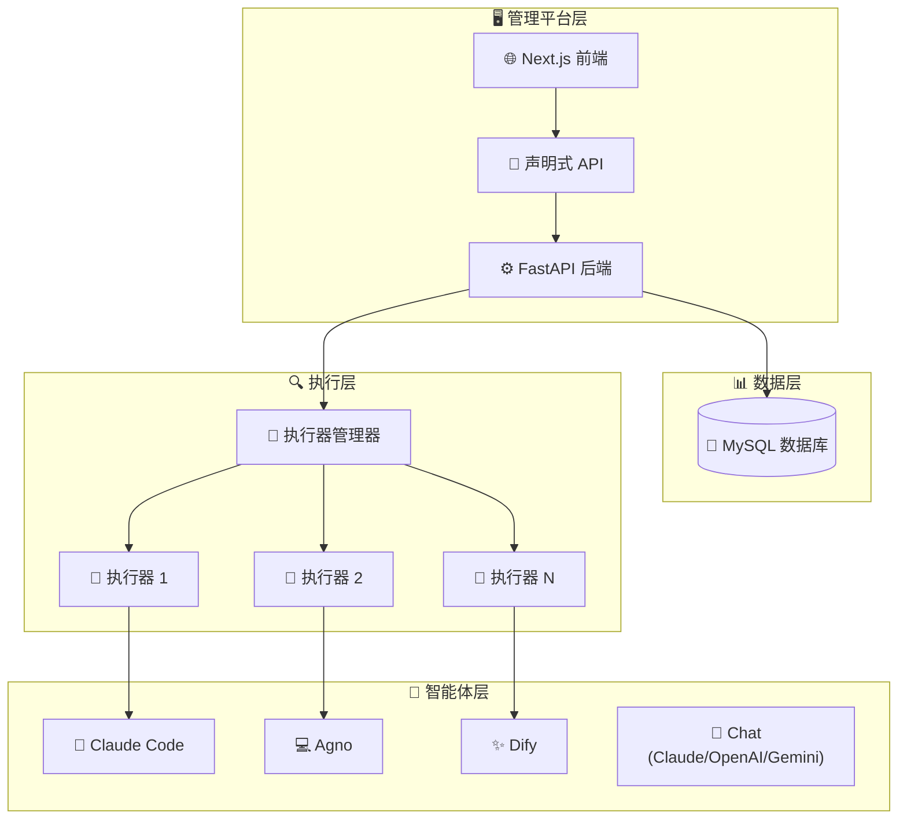

# Wegent
> 🚀 一个定义、组织和运行智能体 AI的开源平台

[English](README.md) | 简体中文

[](https://python.org)
[](https://fastapi.tiangolo.com)
[](https://nextjs.org)
[](https://docker.com)
[](https://claude.ai)
[](https://ai.google.dev)
[](https://github.com/wecode-ai/wegent/releases)

<div align="center">

### 🚀 **构建你的 AI 智能体工作团队**

*从编程助手到新闻分析 - 部署真正能干活的智能代理*

[快速开始](docs/zh/getting-started/quick-start.md) · [应用场景](#-你能构建什么) · [文档](docs/zh/README.md) · [开发指南](docs/zh/guides/developer/setup.md)

</div>

---

## 💡 你能构建什么？

Wegent 让你通过智能体编排创建强大的 AI 应用：

### 💬 **即开即用的 AI 对话**
内置默认聊天团队，无需配置即可立即开始。支持多种 LLM 提供商，包括 Claude、OpenAI 和 Gemini。可选的联网搜索集成，实现实时信息检索。

### 🖥️ **网页版编程助手**
在浏览器中构建全功能开发环境，可与 GitHub 集成，支持本地或云端的独立开发空间，可运行多个 Coding Agent 同时编码。

### 📰 **新闻智能平台**
创建智能新闻聚合和分析系统，支持多智能体协作模式。

### 🔧 **自定义智能体应用**
可能性无限 - 为以下场景构建智能体：
- **数据分析**：自动化报告生成和可视化
- **内容创作**：博客文章、社交媒体和营销素材
- **客户支持**：具有上下文理解的智能聊天机器人
- **DevOps 自动化**：CI/CD 流水线管理和监控
- **研究助手**：文献综述和知识合成

---

## 📖 什么是 Wegent？

Wegent 是一个开源的 AI 原生操作系统，使您能够大规模定义、组织和运行智能代理。基于 Kubernetes 风格的声明式 API 和 CRD（自定义资源定义）设计模式，Wegent 为创建和管理 AI 智能体生态系统提供了标准化框架。

### 🌟 核心能力

1. **🎨 配置驱动的智能体团队**：通过 YAML 配置定义和运行个性化 Agent 团队，提供网页 UI，无需二次开发。内置默认聊天团队，开箱即用
2. **⚙️ 多引擎架构**：底层支持 Agno 和 Claude Code 两个 Agent 执行引擎，Chat Shell 支持直接调用 LLM API（Claude、OpenAI、Gemini）
3. **🔒 独立沙箱环境**：每个 Agent 团队运行在独立沙箱环境中，支持多个 Agent 团队同时运行
4. **🤝 高级协作模式**：对话模式可以实现并行、Leader、Solo 等 Agent 协作模式，完成新闻洞察、内容检索等复杂工作流
5. **💻 AI 编码集成**：编码模式可以与 GitHub/GitLab 等代码服务对接，实现代码开发、review 等 AI Coding 工作流
6. **🔍 联网搜索集成**：Chat Shell 团队可选的联网搜索功能，通过通用 HTTP 适配器支持多种搜索引擎（SearXNG、Google Custom Search、Bing、Brave 等），支持用户自选搜索引擎。



### 🎯 核心概念

> **📖 术语说明**：代码中的 `Team` 对应用户界面的"**智能体**"，`Bot` 对应用户界面的"**机器人**"。用户通过创建"智能体"来执行任务，而"机器人"是组成智能体的基础组件。

- **👻 Ghost**：智能体的"灵魂" - 定义个性、能力和行为模式
- **🧠 Model**：AI 模型配置 - 定义环境变量和模型参数
- **🐚 Shell**："可执行程序" - 能够启动智能体的程序
- **🤖 Bot (机器人)**：完整的智能体实例，结合了 Ghost + Shell + Model
- **👥 Team (智能体)**：由多个 Bot + 协作模型组成，用户直接使用的 AI 助手
- **🤝 Collaboration**：定义团队中 Bot 之间的交互模式（类似工作流）
- **💼 Workspace**：用于任务和项目的隔离工作环境
- **🎯 Task**：分配给智能体(Team)的可执行工作单元

> 💡 **详细的 YAML 配置文档**:
- [完整的 YAML 配置示例和字段说明](docs/zh/reference/yaml-specification.md)


## 🚀 快速开始

### 前置要求

- Docker 和 Docker Compose
- Git

1. **克隆仓库**
   ```bash
   git clone https://github.com/wecode-ai/wegent.git
   cd wegent
   ```

2. **启动平台**
   ```bash
   docker-compose up -d
   ```

3. **访问 Web 界面**
   - 在浏览器中打开 http://localhost:3000

4. **配置 GitHub 访问令牌**
   - 按照页面说明配置您的 GitHub 访问令牌

5. **配置 Bot**

   Wegent 内置了一个开发 Bot。对于 Claude Code 运行时，请设置以下环境变量：

   ```json
   {
     "env": {
       "ANTHROPIC_MODEL": "openrouter,anthropic/claude-sonnet-4",
       "ANTHROPIC_AUTH_TOKEN": "sk-xxxxxx",
       "ANTHROPIC_BASE_URL": "http://xxxxx",
       "ANTHROPIC_DEFAULT_HAIKU_MODEL": "openrouter,anthropic/claude-haiku-4.5"
     }
   }
   ```

   **重要提示 - 环境变量命名:**

   不同的 Shell 运行时使用不同的环境变量名称进行 API 认证:

   - **Claude Code Shell**: 使用 `ANTHROPIC_AUTH_TOKEN`
   - **Agno Shell**: 使用 `ANTHROPIC_API_KEY`
   - **Dify Shell**: 使用 `DIFY_API_KEY` 和 `DIFY_BASE_URL`
   - **Chat Shell**: 使用 `OPENAI_API_KEY` (OpenAI)、`ANTHROPIC_API_KEY` (Claude) 或 `GOOGLE_API_KEY` (Gemini)

   请根据您的 Shell 配置设置正确的环境变量。具体要求请查看 Shell 文档或 `executor/agents/` 代码。

6. **运行任务**

   在任务页面，选择您的项目和分支，描述您的开发需求，例如使用 Python 实现冒泡排序算法

## 🏗️ 架构



## 🛠️ 开发

详细的开发环境搭建说明请参阅 [开发指南](docs/zh/guides/developer/setup.md)。

### 项目结构

```
wegent/
├── backend/          # FastAPI 后端服务
├── frontend/         # Next.js Web 界面
├── executor/         # 任务执行引擎
├── executor_manager/ # 执行编排
├── shared/           # 通用工具和模型
├── wegent-cli/       # kubectl 风格的 CLI 工具 (wectl)
└── docker/           # 容器配置
```

### 快速开发环境设置

1. **后端开发**
   ```bash
   cd backend
   ./start.sh
   # 或手动执行: uv sync && source .venv/bin/activate && uvicorn app.main:app --host 0.0.0.0 --port 8000 --reload
   ```

2. **前端开发**
   ```bash
   cd frontend
   npm install
   npm run dev
   ```

3. **运行测试**
   ```bash
   # 后端测试
   cd backend && python -m pytest

   # 前端测试
   cd frontend && npm test
   ```

完整的开发环境搭建说明（包括数据库配置、环境变量设置和故障排查）请参阅 [开发指南](docs/zh/guides/developer/setup.md)。


## 🤝 贡献

我们欢迎贡献！详情请参阅我们的[贡献指南](CONTRIBUTING.md)。

### 开发工作流

1. Fork 仓库
2. 创建功能分支
3. 进行更改
4. 添加测试
5. 提交 Pull Request

## 📞 支持

- 🐛 问题反馈：[GitHub Issues](https://github.com/wecode-ai/wegent/issues)

## 👥 贡献者

感谢以下开发者对本项目的贡献，为了让项目变得更好 💪

<!-- readme: contributors -start -->
<table>
<tr>
    <td align="center">
        <a href="https://github.com/qdaxb">
            
            <br />
            <sub><b>Axb</b></sub>
        </a>
    </td>
    <td align="center">
        <a href="https://github.com/feifei325">
            
            <br />
            <sub><b>Feifei</b></sub>
        </a>
    </td>
    <td align="center">
        <a href="https://github.com/Micro66">
            
            <br />
            <sub><b>MicroLee</b></sub>
        </a>
    </td>
    <td align="center">
        <a href="https://github.com/cc-yafei">
            
            <br />
            <sub><b>YaFei Liu</b></sub>
        </a>
    </td>
    <td align="center">
        <a href="https://github.com/moqimoqidea">
            
            <br />
            <sub><b>Moqimoqidea</b></sub>
        </a>
    </td>
    <td align="center">
        <a href="https://github.com/2561056571">
            
            <br />
            <sub><b>Xuemin</b></sub>
        </a>
    </td>
    <td align="center">
        <a href="https://github.com/fengkuizhi">
            
            <br />
            <sub><b>Fengkuizhi</b></sub>
        </a>
    </td>
    <td align="center">
        <a href="https://github.com/johnny0120">
            
            <br />
            <sub><b>johnny0120</b></sub>
        </a>
    </td></tr>
<tr>
    <td align="center">
        <a href="https://github.com/jolestar">
            
            <br />
            <sub><b>Jolestar</b></sub>
        </a>
    </td></tr>
</table>
<!-- readme: contributors -end -->

---

<p align="center">由 WeCode-AI 团队用 ❤️ 制作</p>
